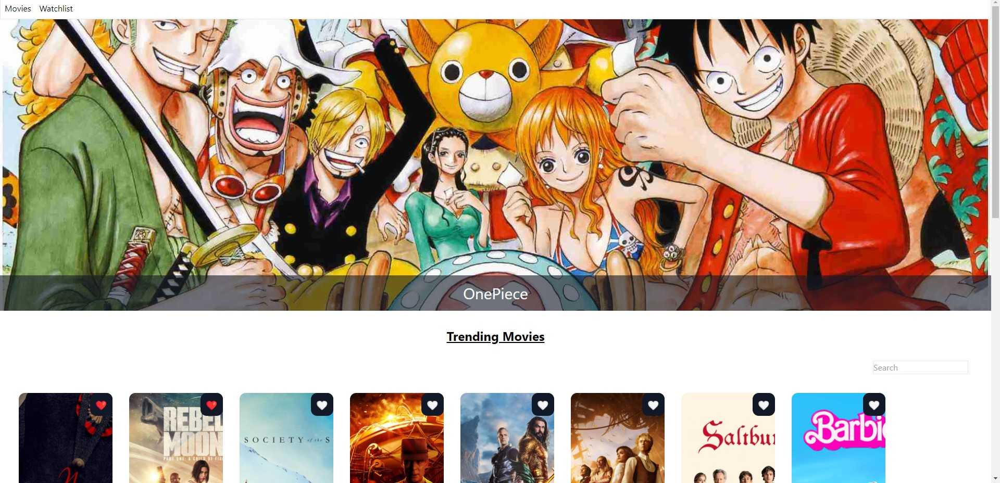
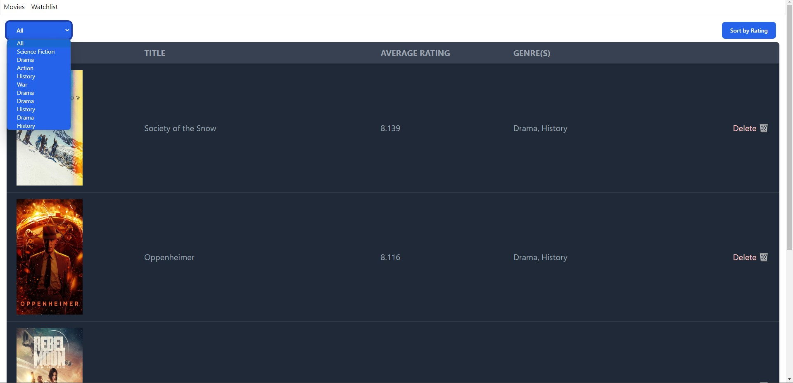

# React Movie Data Base 

#Deployment Link - https://reactmoviedatabase-7ly0x1s2q-anions-projects.vercel.app/

# Smaller clone of the IMDB built using TMDB-API built purely using React 

# Description about the WebApp 
The app has been implemented using React, and it will interact with the TMDB API to fetch movie data. The user interface will be designed using CSS, and it uses Tailwind CSS to assist with styling as desired. The app's data, including the list of favourite movies, will be stored in the browser's local storage to make it persistent across sessions.

# Features of the WebApp 
1. HomePage- On the homepage the user can have a look at the trending movies that is fecthed with the help of TMDB API and add the movies to his watchlist and also search for a specific movie if they wish to.
2. WatchList Page - On the Watchlist Page the user can have a look at the movies that they have added and can sort them by rating and also filter them by genre
3. Deletion of movies from the Watchlist
4. Sorting by rating
5. Filter the movies by genre

